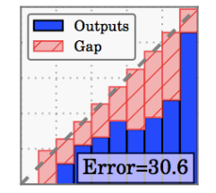

## 🦄 期望校准误差 Expected Calibration Error (ECE)
如果借用[校准曲线](./calibration_curve.md)，可以理解 ECE 就是校准曲线到对角线的距离的加权平均。

假设你现在已经画好了一个校准曲线，分成 $M$ 段（$M$ bins），然后每段有 $B_i$ 个样本，ECE 的计算方式为：

-p(B_i)|}})

- $y(B_i)$: 这一分段中，真值（0/1）的均值
- $p(B_i)$: 这一分段中，预测值（概率）的均值
- $|B_i|$: 这一分段中的样本个数
- $N$: 总样本量

因为是加权的结果，且每个权重 ${|y(B_i)-p(B_i)|}$ 都小于等于1，因此 ECE 的取值范围是固定的 [0,1]，方便用于不同模型的横向对比：**ECE 越低的模型，模型预测概率与真实情况越接近**。

&nbsp;

## 🐬 最大校准误差 Maximum Calibration Error (MCE)
ECE 是校准曲线到对角线的距离的加权平均，而 MCE 是校准曲线到对角线的距离的最大值。借用上面的例子，MCE 的计算方式为：

}\({|y(B_i)-p(B_i)|}\))

- $y(B_i)$: 这一分段中，真值（0/1）的均值
- $p(B_i)$: 这一分段中，预测值（概率）的均值

和 ECE 类似，因为所有的 ${|y(B_i)-p(B_i)|}$ 都小于等于1，因此 MCE 的取值范围是固定的 [0,1]，方便用于不同模型的横向对比：**MCE 越低的模型，模型预测概率与真实情况越接近**。

&nbsp;

## 🐈‍ 相同与区别
ECE 和 MCE 都利用了“校准曲线到对角线的距离”，但是 ECE 更多关注到“平均”情况，或者说整体情况；而 MCE 则更多关注到“最糟糕的情况”。